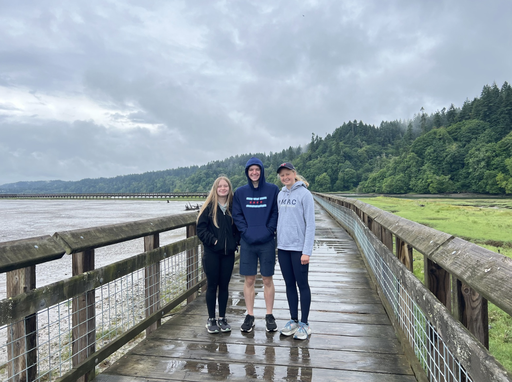
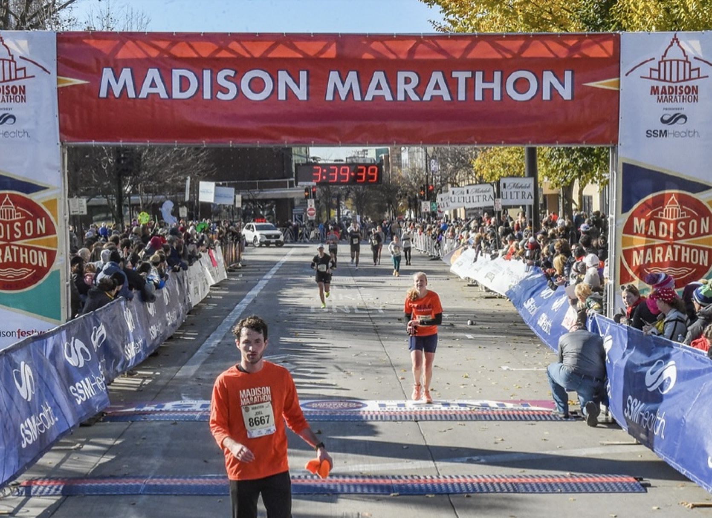
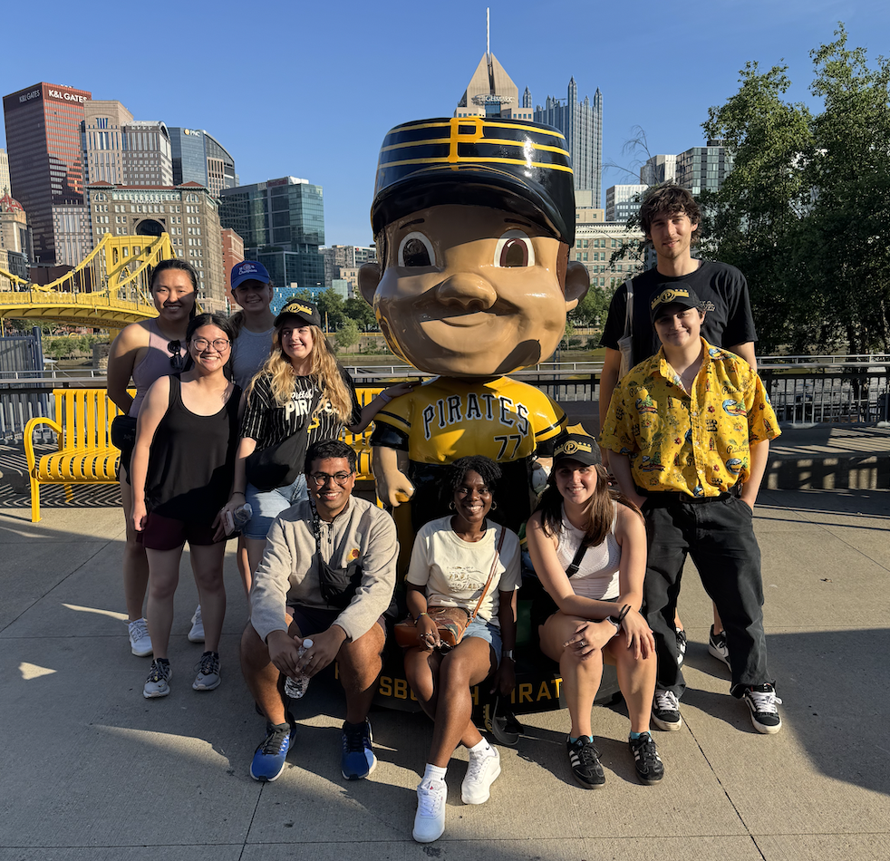

::: {#intro-heading}
Welcome, and thanks for visiting my website!

I am a second-year PhD student in the [Department of Statistics & Data Science](https://www.cmu.edu/dietrich/statistics-datascience/index.html) at Carnegie Mellon University in Pittsburgh, PA. I graduated from [Macalester College](https://www.macalester.edu/mscs/) in 2023, majoring in Statistics and minoring Computer Science and Economics.

I am advised by [Will Townes](https://willtownes.github.io/) and am part of the CMU [Delphi group](https://delphi.cmu.edu/). My current research is centered around statistical methods for wastewater-based epidemiology. I am also in the process of wrapping up a project in collaboration with [Weijing Tang](https://sites.google.com/andrew.cmu.edu/weijingtang/home?authuser=0) and [Phoebe Lam](https://www.lshlab.org/). Our work compares moderated nonlinear factor analysis and standardization methods for psychology research. Aside from these projects, I'm also dabbling in sports analytics research in CMU's [Sports Analytics Center](https://www.cmu.edu/dietrich/statistics-datascience/cmsac/).  

At CMU, I have been fortunate to both TA and become involved in pedagogical research. I am currently working on a project in collaboration with [Sara Colando](https://scolando.github.io/) and [Alex Reinhart](https://www.refsmmat.com/) which analyzes statistics students’ writing before and after the emergence of Large Language Models.

 
:::

### About Me

In addition to statistics & data science, I also enjoy running, hiking, volunteering with [Common Pantry](https://www.commonpantry.org/), entering the [CAUSE caption contest](https://www.causeweb.org/cause/caption-contest/2025), watching sports (especially MLB and women's professional running), and spending time with friends and family.

::: {layout-nrow="2"}

:::
